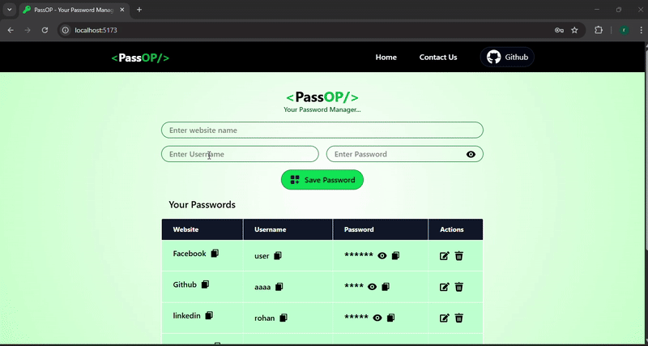
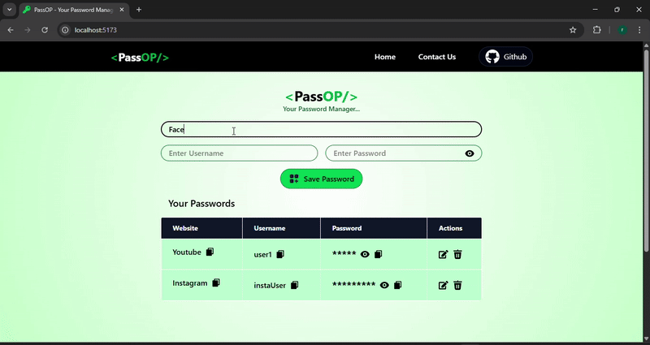
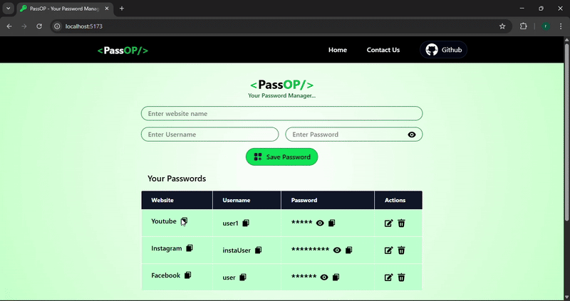
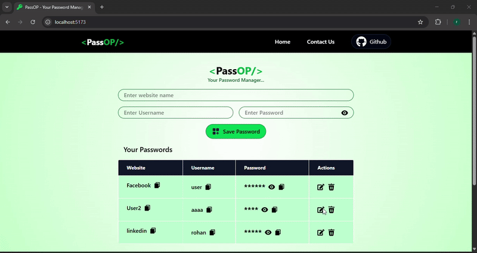

# 🔐 PassOP - Password Manager

A **secure and responsive** password manager built using **React and Tailwind CSS**, allowing users to store, edit, delete, and copy their credentials with ease.




## 🚀 Features  
✅ **Add, Edit, Update, and Delete** website credentials  
✅ **Copy username and password** with a single click  
✅ **LocalStorage-based credential storage** for quick access  
✅ **Fully Responsive** – Works seamlessly across all devices  
✅ **Modern UI** – Clean and intuitive design for ease of use  


## 🛠️ Tech Stack  
- **Frontend :** React, Tailwind CSS  
- **State Management :** useState, useEffect  
- **Storage :** LocalStorage  


## 🎥 Live Demo  

### 1️⃣ Responsiveness  
  


### 2️⃣ Adding & Managing Credentials  
  


### 3️⃣ Copy & Delete Functionality  
 


### 4️⃣ Editing Credentials  
  


## 🌍 Hosted App  
🔗 **Live App:** [Click Here to Open](https://67e01fc3c32c9d4c10c48d8d--poetic-snickerdoodle-1d3bb5.netlify.app/)  


## 🛠️ Installation & Setup  
To run this project locally, follow these steps:  


### Clone the repository
```sh

git clone https://github.com/YourUsername/Password-Manager.git
```
### Navigate to the project directory
```sh
cd PASSMANOP
```

### Install dependencies
```sh
npm install
```

### Start the development server
```sh
npm run dev
```

## 💡 Future Improvements  
- 🔑 **User Authentication** – Allow users to log in and manage passwords securely  
- 🛠️ **Backend Integration** – Connect with **Node.js, Express, and MongoDB** for encrypted password storage  
- 🔍 **Search Functionality** – Easily search for stored credentials  
- 📋 **Export Data** – Let users export their saved passwords  

## 📜 License  
This project is for educational purposes only.  

